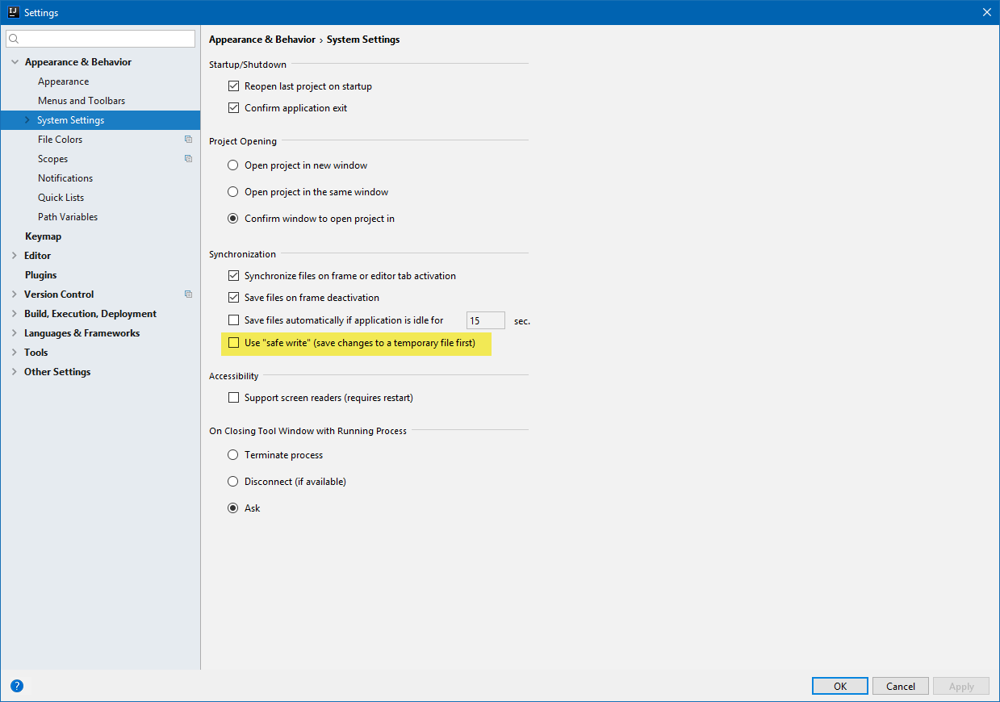
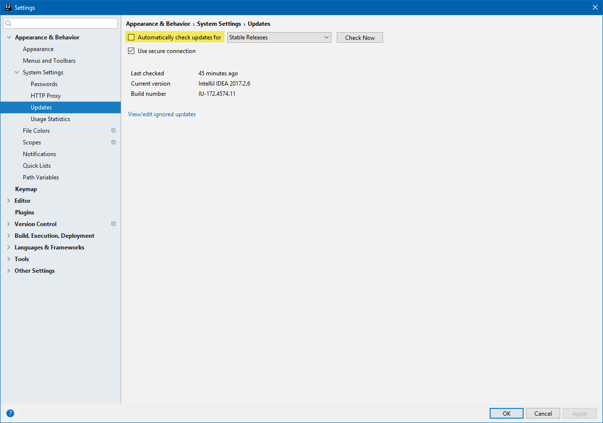
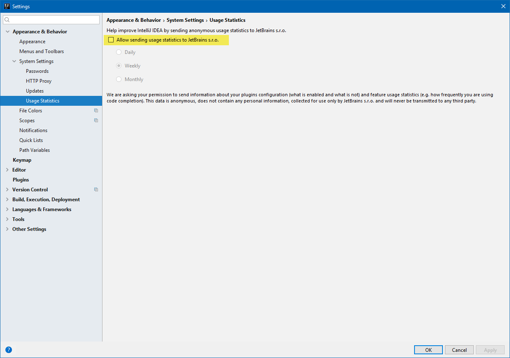
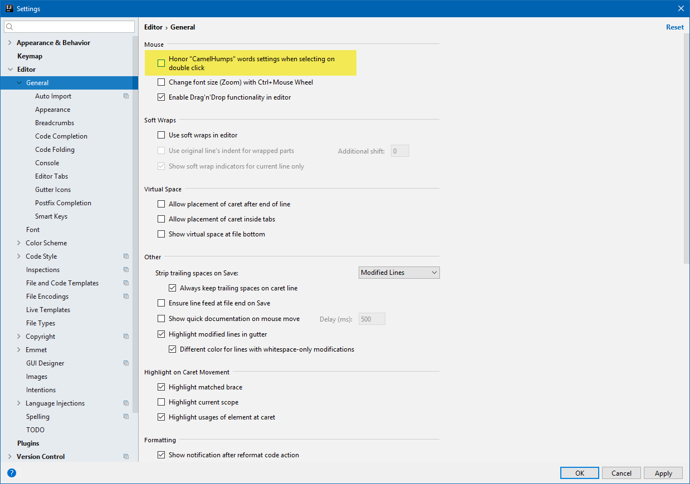
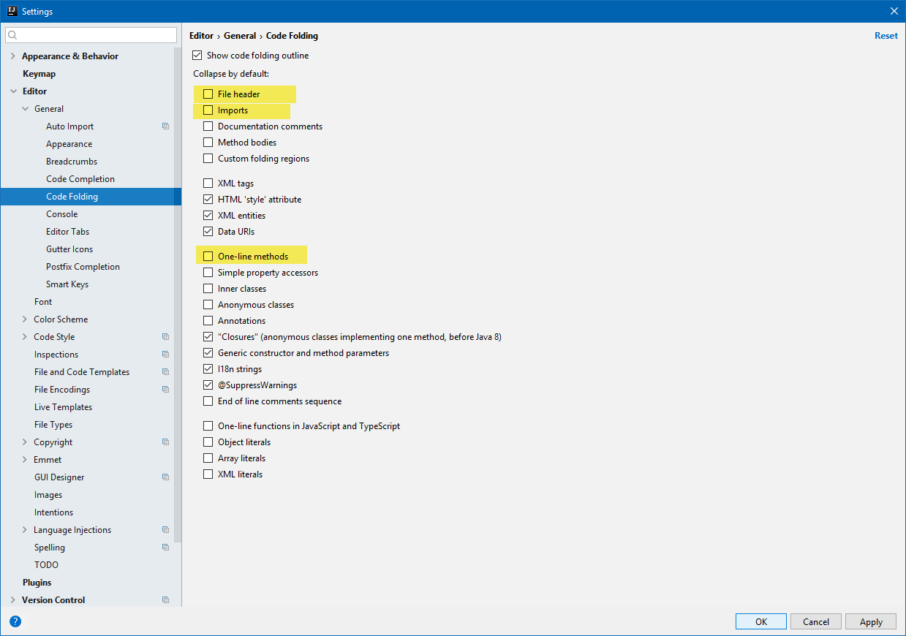
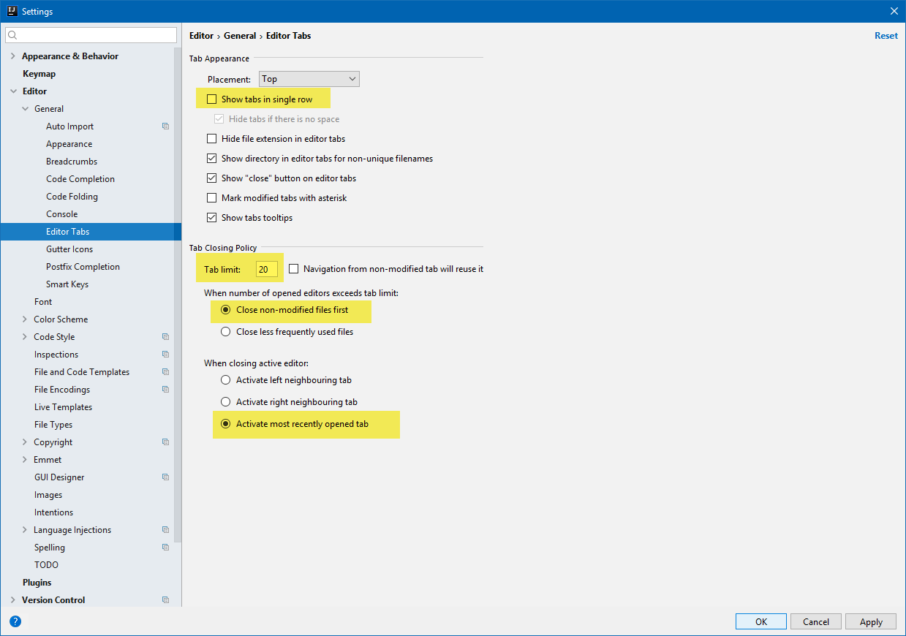
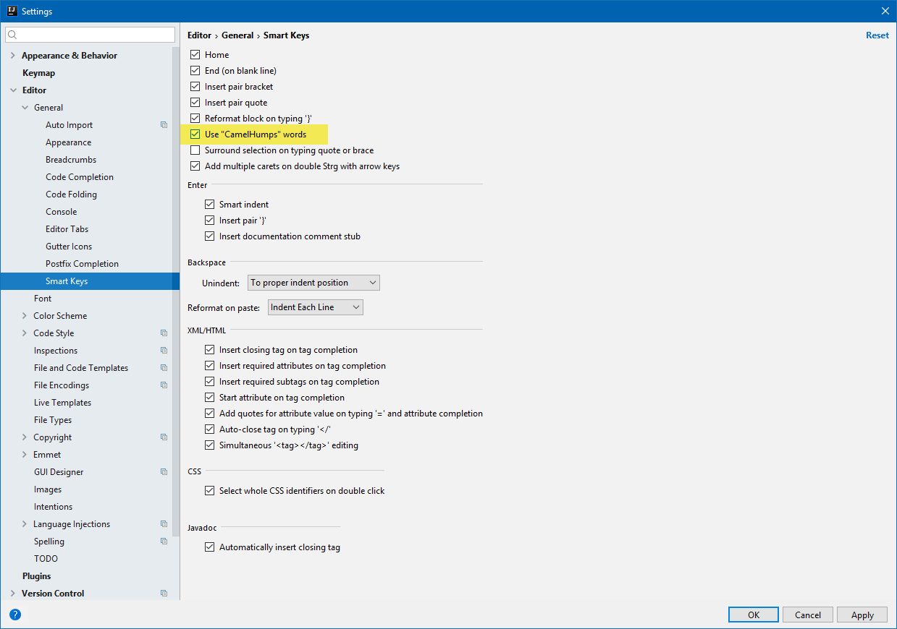
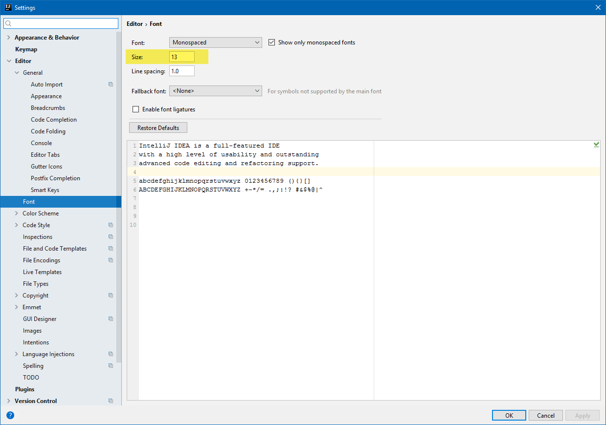
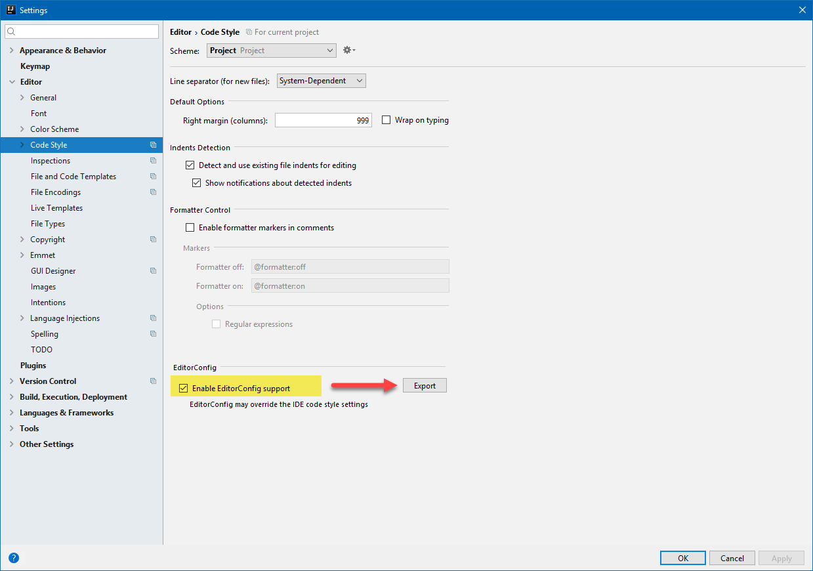
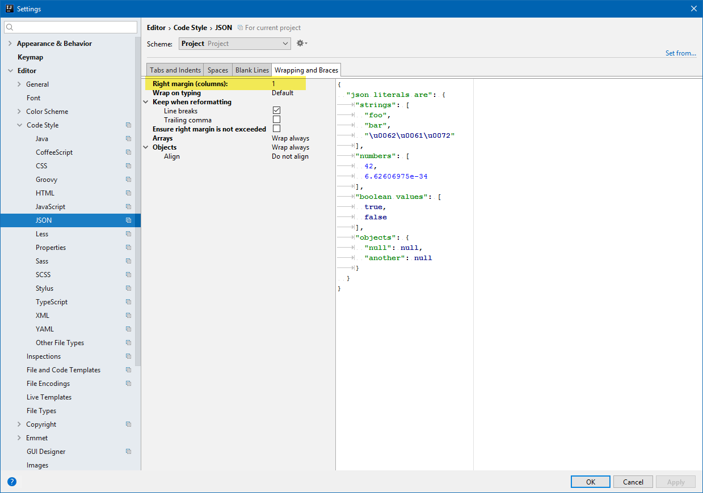

# lint-auto-fix
Save action: automatically fix ESLint errors

# Links

- https://www.google.ch/search?q=husky+js&oq=husky+js&aqs=chrome..69i57.1207j0j4&sourceid=chrome&ie=UTF-8
- https://davidwalsh.name/prevent-bad-commits-husky
- https://github.com/typicode/husky
- https://github.com/typicode/husky/tree/dev
- https://www.google.ch/search?q=fix+lint+error+on+save+intellij&oq=fix+lint+error+on+save+intellij&aqs=chrome..69i57.14599j0j7&sourceid=chrome&ie=UTF-8
- https://intellij-support.jetbrains.com/hc/en-us/community/posts/115000221130-Eslint-autofix-on-save-for-webstorm
- https://youtrack.jetbrains.com/issue/WEB-24452#comment=27-1763733&u=1480596291921
- https://youtrack.jetbrains.com/issue/IDEABKL-6722#u=1401303765668
 
# Plugins

- Markdown &rarr; mit JavaFX preview (for markdown)??? IntelliJ hat dies selbst vorgeschlagen bei offenem Markdown File.
- GitToolBox
- Key Promoter X (display ballon tips with keyboard shortcuts for IntelliJ actions)
- SvgViewer 2

# Settings

##### Appearance & Behavior > Disable "safe write"


##### Appearance & Behavior > Disable "check for automatic updates"


##### Appearance & Behavior > Disable "usage statistics"


##### Editor > General (CamelHumps &rarr; cf. Smart Keys)


##### Editor > Code Folding


##### Editor > Editor Tabs


##### Editor > Smart Keys (CamelHumps &rarr; cf. Editor General)


##### Editor > Font


##### Editor > Code Style
- Project specific settings &rarr; cf. `<project>/.idea/codeStyleSettings.xml`


##### Editor > Code Style > Create file `.editorconfig`

```properties
# EditorConfig is awesome: http://EditorConfig.org

# top-most EditorConfig file
root = true

[*]
charset = utf-8
indent_style = tab
end_of_line = crlf
trim_trailing_whitespace = true
insert_final_newline = true

[package.json]
indent_style = space
indent_size = 2

[*.md]
trim_trailing_whitespace = false
```



##### Editor > Code Style > JSON
- Trick for auto-format JSON files &rarr; set 'Right margin (columns)' = 1
- With this trick, the JSON will be nicely formatted on 'Reformat Code (Ctrl Alt L)'
- Hmmmm... this trick seems not to be necessary with IntelliJ 2017.x

```diff
- Does it work on Auto-Save (with Plugin 'Save Actions')??? needs to be tested!!!
```



##### Editor > Inspections
```diff
- TODO
```


##### Editor > Live Templates
```diff
- TODO
- console.log
```


```diff
- TODOs
- typo (ignore spelling)
```


##### Title


##### Title


##### Title


##### Title


##### Title


##### Title


##### Title


##### Title


##### Title


##### Title


##### Title


##### Title


##### Title


##### Title


##### Title


##### Title


##### Title


##### Title


##### Title

