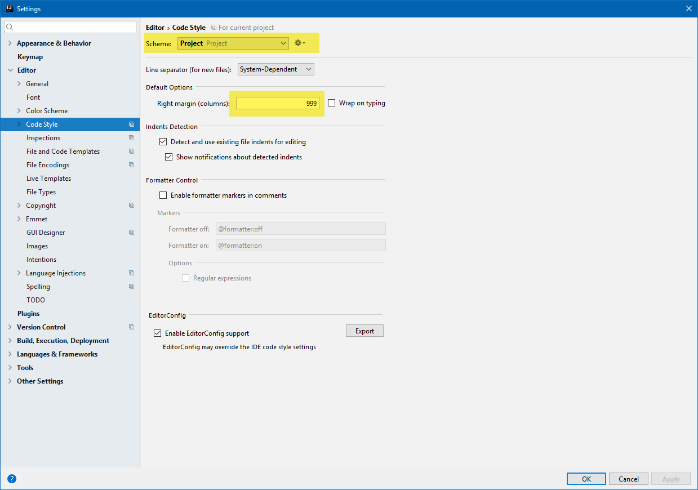

# lint-auto-fix
Save action: automatically fix ESLint errors

# Initial Project Setup

`npm init`

`npm install eslint --save-dev`

### ESLint

https://eslint.org/docs/user-guide/getting-started

`.\node_modules\.bin\eslint --init`

- How would you like to configure ESLint? Answer questions about your style
- Are you using ECMAScript 6 features? Yes
- Are you using ES6 modules? Yes
- Where will your code run? Browser
- Do you use CommonJS? No
- Do you use JSX? Yes
- Do you use React? Yes
- What style of indentation do you use? Tabs
- What quotes do you use for strings? Single
- What line endings do you use? Unix
- Do you require semicolons? Yes
- What format do you want your config file to be in? JSON

# Links

Markdown
- [GitHub-Flavored-Markdown-(GFM)-language-IDs](https://github.com/jmm/gfm-lang-ids/wiki/GitHub-Flavored-Markdown-(GFM)-language-IDs)

Husky etc.
- https://www.google.ch/search?q=husky+js&oq=husky+js&aqs=chrome..69i57.1207j0j4&sourceid=chrome&ie=UTF-8
- https://davidwalsh.name/prevent-bad-commits-husky
- https://github.com/typicode/husky
- https://github.com/typicode/husky/tree/dev
- https://www.google.ch/search?q=fix+lint+error+on+save+intellij&oq=fix+lint+error+on+save+intellij&aqs=chrome..69i57.14599j0j7&sourceid=chrome&ie=UTF-8
- https://intellij-support.jetbrains.com/hc/en-us/community/posts/115000221130-Eslint-autofix-on-save-for-webstorm
- https://youtrack.jetbrains.com/issue/WEB-24452#comment=27-1763733&u=1480596291921
- https://youtrack.jetbrains.com/issue/IDEABKL-6722#u=1401303765668
 
# Plugins

- GitToolBox
- Key Promoter X (display ballon tips with keyboard shortcuts for IntelliJ actions)
- SvgViewer 2
- File Watchers


# External Tools

```
npm run lint-fix
C:\Program Files (x86)\nodejs\npm.cmd
run lint-fix $FilePathRelativeToProjectRoot$
$ProjectFileDir$
```


# Settings

### Appearance & Behavior > Disable "safe write"


### Appearance & Behavior > Disable "check for automatic updates"


### Appearance & Behavior > Disable "usage statistics"


### Editor > General (CamelHumps &rarr; cf. Smart Keys)


### Editor > Code Folding


### Editor > Editor Tabs


### Editor > Smart Keys (CamelHumps &rarr; cf. Editor General)


### Editor > Font


### Editor > Code Style

- Project specific settings &rarr; cf. `<project>/.idea/codeStyleSettings.xml`



### Editor > Code Style > Create file `.editorconfig`

```properties
# EditorConfig is awesome: http://EditorConfig.org

# top-most EditorConfig file
root = true

[*]
charset = utf-8
indent_style = tab
end_of_line = lf
trim_trailing_whitespace = true
insert_final_newline = true

[package.json]
indent_style = space
indent_size = 2

[*.md]
trim_trailing_whitespace = false
```


### Editor > Code Style > JavaScript


### Editor > Code Style > JSON

- Trick for auto-format JSON files &rarr; set 'Right margin (columns)' = 1
- With this trick, the JSON will be nicely formatted on 'Reformat Code (Ctrl Alt L)'
- Hmmmm... this trick seems not to be necessary with IntelliJ 2017.x

```diff
- Does it work on Auto-Save (with Plugin 'Save Actions')??? needs to be tested!!!
```


### Editor > Inspections

```diff
- TODO
```


### Editor > Live Templates

```diff
- TODO
- console.log
```


### Languages & Frameworks > JavaScript

- React JSX (JSX in ECMAScript 6)


### Languages & Frameworks > JavaScript > Code Quality Tools > ESLint


### Languages & Frameworks > Markdown

- jar:file:/C:/Program%20Files/JetBrains/IntelliJ%20IDEA%202017.2.6/plugins/markdown/lib/markdown.jar!/org/intellij/plugins/markdown/settings/default.css
- Markdown Preview Browser: **JavaFX WebView**


### TODO

```diff
- typo (ignore spelling)
```
